# Statistics for my Diary, Blog and Projects

Create statistics and visual representations of the frequency of entries into my diary and pages for projects, travel and my blog.

## Short summary

- Words: 1,432,423
- Reading time: 15 hours 4 minutes
- Documents: 143
- Images: 132

## Categories and locations

- Obsidian and Quartz **Diary** at [diary.saiht.de](https://diary.saiht.de) has 1,023,452 words that would require 13 hours to read. In total some 83 markdown files. 312 of 18,923 days are documented
- Wordpress **Blog** at [saiht.de/blog](https://saiht.de/blog) with 104 articles and 42,324 words
- **Legacy website** of saiht.de at [saiht.de/legacy](https://saiht.de/legacy) with 64 pages, 13,124 words
- Older projects at **subdomains**, listed at [saiht.de/x](https://saiht.de/x) with 20 subdomains, 35 pages, 1,234 words
- **GitHub** projects with their website: 170 projects, with the main websites containing 23,234 words

## Details on Obsidian and Quartz

| Category | Markdown files | Files | Folders | Size (Bytes) | Images |   Words   |
|----------|---------------:|-------|--------:|-------------:|:------:|:---------:|
| Blog     |            512 |  1731 |      76 |  162,437,617 |     52 |   845,601 |
| Diary    |             32 |   947 |      35 |   49,929,432 |     16 |    16,452 |
| Projects |             18 |    18 |       0 |      946,419 |      5 |    84,215 |
| Travel   |             72 |    72 |       6 |   17,622,758 |     47 |   154,875 |
| Websites |            444 |   444 |      29 |   21,701,977 |     32 |    20,154 |
| All      |           1342 |  1342 |      20 |   89,448,124 |    245 | 1,425,754 |

## Clickable Graph

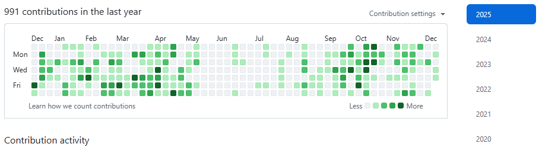

## Details on 156 Github Projects, sorted by Category

### Robotics

- T400 - link, 23 words
- T500 - link, 24 words

## Procedure, Examples and inspiration

Some progress was made with Obsidian, and in time I will copy a lot of information to this markdown diary and repository. While doing so I might add some translation of existing German documentations there. Further I want to include my Wordpress blog, subdomains and legacy websites.

## 2025

- Diary: 20
- Projects: 5
- Blog: 3
- Travel: 2

## 2024

- Highlights with links?
- Only one?
- Calculated score?

## Layered

Last processed: 2025/12/18 - 18,339 days

- Diary: 513
- Projects: 16
- Blog: 38
- Travel: 32

## By month in Diary/Travel/Projects/Blog

Maximum value:

- Diary: 31 - January 1997 🟩 
- Projects: 15 - March 2006 🟦
- Travel: 28 - August 2024 🟥
- Blog: 5 - October 2009 🟨

Table created by Python (GitHub has 4 shades plus white, but this can be tweaked once we have answers):

|      |   xxx0   |    xxx1   |    xxx2    |    xxx3   |   xxx4   |    xxx5   |    xxx6   |   xxx7   |    xxx8   |   xxx9   |   xxx10   |
|------|:--------:|:---------:|:----------:|:---------:|:--------:|:---------:|:---------:|:--------:|:---------:|:--------:|:---------:|
| 202x |  8/6/0/1 |  12/1/4/4 |  10/7/4/9  |  13/8/5/5 |  6/8/4/7 |  8/1/5/6  |           |          |           |          |           |
| 201x | 3/0/1/13 | 20/2/3/12 |  10/7/5/5  |  2/7/3/12 |  2/2/1/3 |  7/7/0/8  |  0/11/0/5 | 0/10/5/3 | 19/10/0/9 | 10/2/4/9 | 20/10/2/6 |
| 200x |  1/5/4/6 |  10/5/4/2 |  8/7/4/10  |  13/2/3/6 | 4/10/1/7 |  9/2/3/0  |  17/0/3/4 |  7/8/0/9 |  7/7/4/2  | 8/10/3/4 |  3/1/2/13 |
| 199x |  0/9/1/6 |  18/4/4/4 |  10/12/2/2 |  2/4/2/5  | 4/10/4/9 |  4/5/1/6  |  14/6/5/0 |  8/0/3/9 |  6/12/2/3 |  1/6/5/3 | 13/10/4/3 |
| 198x | 1/6/0/10 |  0/7/1/11 | 10/11/1/13 | 11/7/4/11 |  4/6/3/5 | 13/2/5/11 | 1/11/1/13 |  5/8/3/7 | 11/6/4/10 |  5/9/0/0 |  6/11/1/2 |
| 197x |          |           |            |           |          |  0/9/1/6  |  3/2/0/1  | 9/3/2/13 | 7/10/2/10 | 17/1/5/6 |  4/8/5/9  |

Data stored in `.csv`-files. How to parse, how to generate?

## History

The documents are located at three locations:

- **Quartz** at [https://kreier.github.io/quartz/](https://kreier.github.io/quartz/)
- **Obsidian** at [https://saiht.de/obsidian](https://saiht.de/obsidian) or diary.saiht.de
- **Wordpress** at [https://saiht.de/blog](https://saiht.de/blog)

### Obsidian

I use the [Novel word count](https://www.obsidianstats.com/plugins/novel-word-count) Community plugin to determine the size of the whole vault

- 21.12.2025 13.263 words, 50 minutes read with the [Novel word count](https://www.obsidianstats.com/plugins/novel-word-count) Community plugin

|    date    | Blog | Diary | Projects | Travel | Websites | md files | Total words | Total minutes |
|:----------:|:----:|:-----:|:--------:|:------:|:--------:|:--------:|:-----------:|:-------------:|
| 2025-12-21 |  541 |  4759 |     2830 |   1714 |     1563 |       36 |       13263 |            51 |

### Wordpress

 - 21.12.2025 93 posts, more statistics follows

## One box per day - 18,000 boxes?

How would it look if you get a colored box for each day of your life? Well, let's have a look, just use GitHub contributions as example for the last 8 years:

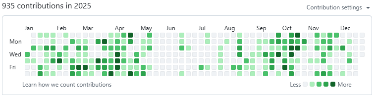
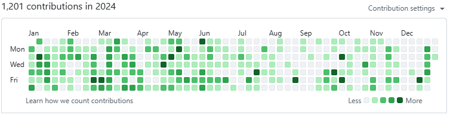
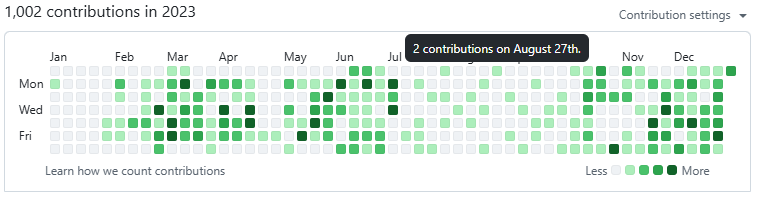
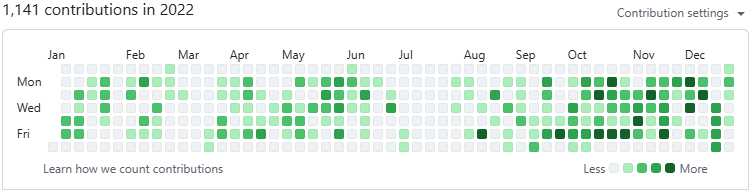
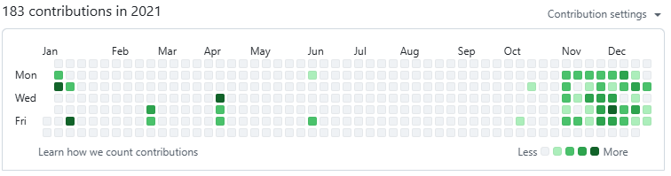
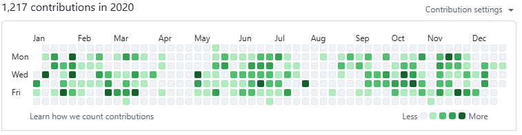
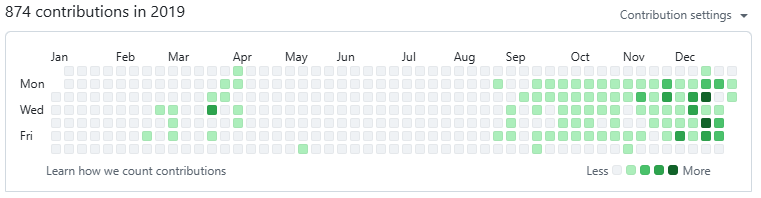
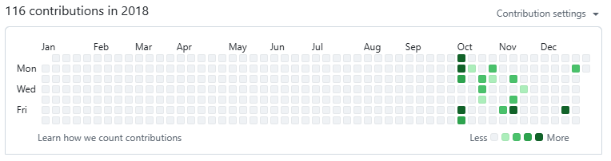

## Better looking if closer together?

I combined above screenshots into one picture where the results are closer together. An inspiration?

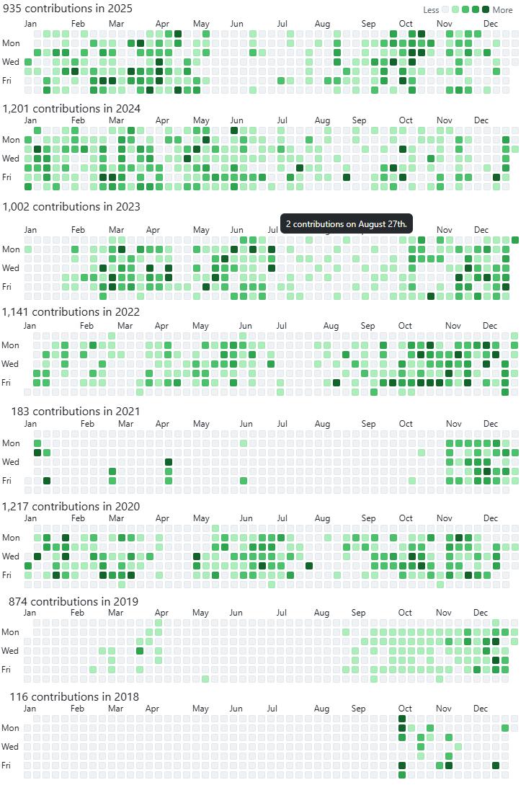

## 19000 days till 10/10/2027

On this day I will have lived 19000 days on earth, and the graduation from SDW will be 17 years ago. How would an overview of all these days look like? Here is a preliminary visual:

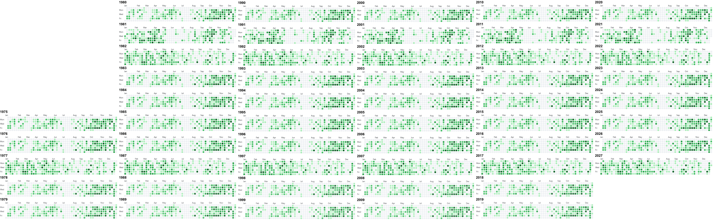

## Workflow

### Static data

Only from time to time I will update the following values:

- /data/details_wordpress.csv with all articles written
- /data/details_legacy.csv with all the articles written
- /data/details_subdomain.csv with all the articles written
- /data/details_github.csv with all the repositories and their main README.md of content

### Automatic run

Each push and successful run from quartz will trigger `python/update_statistics.py`. The Github Action will check out all data. All static data from above will have been processed already. No need to parse them again.

But I need a copy of Obsidian and parse it:

- **Blog**, read the frontmatter entry for the date in `date`
- **Diary**, parse 1975.md to 2026.md for DD.MM.YYYY and count the day if it is bold
- **Projects**, maybe one day a copy of each README for each Github project? But that's two locations to keep updated
- **Travel**, the frontmatter has two entries `created` for when the holiday started and `updated` when it ended. Can it be parsed?
- Websites should be treated as projects, and be counted there too

For the clickable `STAT_GRAPHS` I need to know each day and number of contributions for the 4 categories. And the tooltip could include a link to the article of the day in Blog, Diary, Travel or Project.

### Parts to update in README.md

With some HTML markers and regular expressions parts of the README.md are prepared to be updated by the update python program. The following labels are in there:

- STAT_SUMMARY
- STAT_CATEGORY_LOCATIONS
- STAT_DETAILS_OBSIDIAN
- STAT_GRAPHS
- STAT_GITHUB

### Updated files in this repository

Obviously the results should be written back to the repository. We need the file names for the Github Action `github/workflows/update.yml` that should receive a push `git add data/iteration.json data/version.txt`:

- data/iteration.json
- data/version.txt
- README.md
