# Statistics for my Diary, Blog and Projects

This [repository](https://github.com/kreier/statistics-diary) creates a visual representations and some statistics of my entries into diary, pages for projects, travel and my blog over the last decades.

<!-- START:version -->
Version: v2026.03.26.60
<!-- END:version -->

## Short summary

<!-- START:summary_short -->
- Documents or projects: 143
- Individual pages: 315
- Days documented: 1132 of 18345 (6.17%)
- Total words: 1,432,423
- Total sentences: 3,154
- Total paragraphs: 1,165
- Total images: 5,132
- Required total reading time: 15 hours 4 minutes
<!-- END:summary_short -->

## Detailed overview

<!-- START:summary_detailed -->
1. Obsidian and Quartz **diary** at [diary.saiht.de](https://diary.saiht.de) has 1,023,452 words that would require 13 hours to read. In total some 83 markdown files. 312 of 18,923 days are documented.
   - Diary 🟩: 123 days are documented
   - Blog 🟥: 82 entries
   - Projects 🟦: 15 documented
   - Travel 🟨: 12 countries and 42 days
   - Websites 🟦: 4 major ones and 10 abandoned ones
2. Wordpress **blog** at [saiht.de/blog](https://saiht.de/blog) with 104 articles and 42,324 words
3. **Legacy** website of saiht.de at [saiht.de/legacy](https://saiht.de/legacy) with 64 pages, 13,124 words
4. Older projects at **subdomains**, listed at [saiht.de/x](https://saiht.de/x) with 20 subdomains, 35 pages, 1,234 words
5. GitHub projects with **github** commits: 170 projects, with the main websites containing 23,234 words
6. Websites to some github projects as **github_websites** for 130 projects, containing 14,874 word
7. Additional websites as **google_sites** with 14 sites, containing 1,423 words
<!-- END:summary_detailed -->

## Heatmap last two years

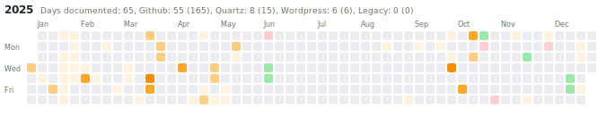
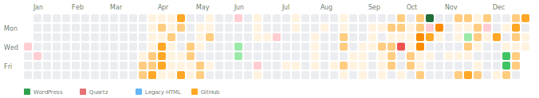

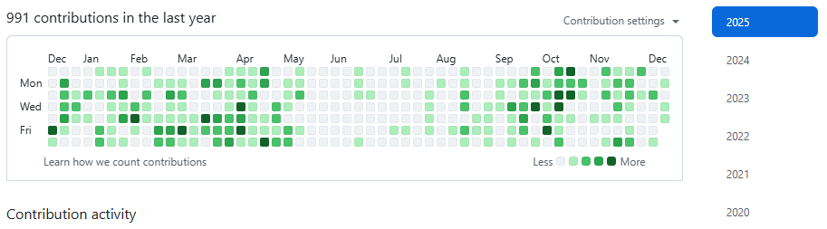

## Table of Source Categories, Labels and Types

I have currently 11 categories of sources that fit 4 types of sources (html, github, wordpress, obsidian) to be parsed individually:

| category           | category_id       | label       |   type   | 
|--------------------|-------------------|-------------|:---------:|
| Diary 🟩           | obsidian-diary   | Diary       | obsidian  |
| Obsidian Blog 🟥   | obsidian-blog    | Blog2       | obsidian  |
| Project 🟪         | obsidian-project | Project     | obsidian  |
| Travel 🟨          | obsidian-travel  | Travel      | obsidian  |
| Website 🟦         | obsidian-website | Website     | obsidian  |
| Wordpress Blog 🟥  | blog             | Blog        | wordpress | 
| Legacy 🟦          | legacy           | Legacy      | html      |
| Subdomain 🟪       | subdomain        | Subdomain   | html      |
| Repository 🟧      | github           | Github      | github    |
| Github Pages 🟧    | github_pages     | GH Pages    | html      |
| Google Site 🟪     | google_site      | Google Site | html      |

For each of these sources in the categories we want 8 metrics:

- items
- pages
- days
- words
- sensences
- paragraphs
- images
- reading_time

| category         | items | pages | days |  words | sentences | paragraphs | images | reading_time |
|------------------|------:|------:|-----:|-------:|----------:|:----------:|:------:|:------------:|
| Diary 🟩          |   142 |   142 |   30 |  66756 |      9537 |       6811 |    475 |     4h27     |
| Obsidian Blog 🟥  |    38 |    38 |   45 |    730 |       104 |        314 |     33 |     0h02     |
| Project 🟪        |    21 |    57 |   29 |   1791 |       256 |         71 |     53 |     0h07     |
| Travel 🟨         |    34 |    73 |    9 |  48251 |      6893 |        866 |     33 |     3h13     |
| Website 🟦        |     7 |    99 |   22 |  32307 |      4615 |        501 |     83 |     2h09     |
| Wordpress Blog 🟥 |    84 |    90 |   18 |    985 |       141 |       1014 |     70 |     0h03     |
| Legacy 🟦         |   164 |   246 |   80 |  18017 |      2574 |        683 |     29 |     1h12     |
| Subdomain 🟪      |    15 |    23 |   23 |  12356 |      1765 |        563 |     43 |     0h49     |
| Repository 🟧     |   150 |   195 |  105 |   1677 |       240 |        162 |     94 |     0h06     |
| Github Pages 🟧   |   134 |   174 |   79 |    715 |       102 |        203 |     40 |     0h02     |
| Google site 🟪    |     2 |    58 |   42 |   1403 |       200 |        218 |     43 |     0h05     |
| Sum              |   791 |  1195 |  482 | 184988 |     26427 |      11411 |    996 |     12h19    |

## Procedure and data location

### Sources

The sources are in the `\sources` folder inside each `\category` subfolder and as sources with a unique id listed in respective `JSON` files and have all their items there. For example the subdomain https://tschechien.saiht.de/ would be of the category Subdomain, source_id would be tschechien_saiht_de and the respective items for pages like `index.html` and `bilder.html` and `einladungen.html` the name before the `.html`. All inside a `json` file, in this case: `\sources\subdomain\tschechien_saiht_de.json`. These three items would be found there.

#### Web view of sources

A static web view of the sources will be generated by the file `\python\manage_sources_webview.py` and be accessable in the `\docs\sources` folder for view from https://kreier.github.io/statistics-diary/sources. At the same time they will be managed from a local webport with Flask in python to change colors, categories or sources.

### Data

### Parsing order

#### Step 1: 

## (1) Details on Obsidian and Quartz

|   Category  | Markdown files | Files | Folders | Size (Bytes) | Images |   Words   |
|-------------|---------------:|------:|--------:|-------------:|:------:|----------:|
| Blog 🟥     |            512 |  1731 |      76 |  162,437,617 |     52 |   845,601 |
| Diary 🟩    |             32 |   947 |      35 |   49,929,432 |     16 |    16,452 |
| Projects 🟦 |             18 |    18 |       0 |      946,419 |      5 |    84,215 |
| Travel 🟨   |             72 |    72 |       6 |   17,622,758 |     47 |   154,875 |
| Websites 🟦 |            444 |   444 |      29 |   21,701,977 |     32 |    20,154 |
| All         |           1342 |  1342 |      20 |   89,448,124 |    245 | 1,425,754 |

## (5) Details on 156 Github Projects, sorted by Category

I ordered my repositories into the following categories:

- Mathematics
- Robotics
- School
- Physics
- Automation
- Curiosity

Metrics I'm interested in: title (repository name), created, size, main language, files, folders, commits. See the github subfolder: [kreier.github.io/statistics-diary/github](https://kreier.github.io/statistics-diary/github/)

### Robotics

- T400 - link, 23 words
- T500 - link, 24 words

## Procedure, Examples and inspiration

Some progress was made with Obsidian, and in time I will copy a lot of information to this markdown diary and repository. While doing so I might add some translation of existing German documentations there. Further I want to include my Wordpress blog, subdomains and legacy websites.

## 2025

- Diary: 20
- Projects: 5
- Blog: 3
- Travel: 2

## 2024

- Highlights with links?
- Only one?
- Calculated score?

## Layered

Last processed: 2025/12/18 - 18,339 days

- Diary: 513
- Projects: 16
- Blog: 38
- Travel: 32

## By month in Diary/Travel/Projects/Blog

Maximum value:

- Diary: 31 - January 1997 🟩 
- Projects: 15 - March 2006 🟦
- Travel: 28 - August 2024 🟨
- Blog: 5 - October 2009 🟥

Table created by Python (GitHub has 4 shades plus white, but this can be tweaked once we have answers):

|      |   xxx0   |    xxx1   |    xxx2    |    xxx3   |   xxx4   |    xxx5   |    xxx6   |   xxx7   |    xxx8   |   xxx9   |   xxx10   |
|------|:--------:|:---------:|:----------:|:---------:|:--------:|:---------:|:---------:|:--------:|:---------:|:--------:|:---------:|
| 202x |  8/6/0/1 |  12/1/4/4 |  10/7/4/9  |  13/8/5/5 |  6/8/4/7 |  8/1/5/6  |           |          |           |          |           |
| 201x | 3/0/1/13 | 20/2/3/12 |  10/7/5/5  |  2/7/3/12 |  2/2/1/3 |  7/7/0/8  |  0/11/0/5 | 0/10/5/3 | 19/10/0/9 | 10/2/4/9 | 20/10/2/6 |
| 200x |  1/5/4/6 |  10/5/4/2 |  8/7/4/10  |  13/2/3/6 | 4/10/1/7 |  9/2/3/0  |  17/0/3/4 |  7/8/0/9 |  7/7/4/2  | 8/10/3/4 |  3/1/2/13 |
| 199x |  0/9/1/6 |  18/4/4/4 |  10/12/2/2 |  2/4/2/5  | 4/10/4/9 |  4/5/1/6  |  14/6/5/0 |  8/0/3/9 |  6/12/2/3 |  1/6/5/3 | 13/10/4/3 |
| 198x | 1/6/0/10 |  0/7/1/11 | 10/11/1/13 | 11/7/4/11 |  4/6/3/5 | 13/2/5/11 | 1/11/1/13 |  5/8/3/7 | 11/6/4/10 |  5/9/0/0 |  6/11/1/2 |
| 197x |          |           |            |           |          |  0/9/1/6  |  3/2/0/1  | 9/3/2/13 | 7/10/2/10 | 17/1/5/6 |  4/8/5/9  |

Data stored in `.csv`-files. How to parse, how to generate?

## History

The documents are located at three locations:

- **Quartz** at [https://kreier.github.io/quartz/](https://kreier.github.io/quartz/)
- **Obsidian** at [https://saiht.de/obsidian](https://saiht.de/obsidian) or diary.saiht.de
- **Wordpress** at [https://saiht.de/blog](https://saiht.de/blog)

### Obsidian

I use the [Novel word count](https://www.obsidianstats.com/plugins/novel-word-count) Community plugin to determine the size of the whole vault

- 21.12.2025 13.263 words, 50 minutes read with the [Novel word count](https://www.obsidianstats.com/plugins/novel-word-count) Community plugin

|    date    | Blog | Diary | Projects | Travel | Websites | md files | Total words | Total time |
|:----------:|:----:|:-----:|:--------:|:------:|:--------:|:--------:|:-----------:|:----------:|
| 2025-12-21 |  541 |  4759 |     2830 |   1714 |     1563 |       36 |      13,263 |       0h51 |
| 2026-01-19 | 1408 | 27580 |     4366 |   2216 |     1820 |       92 |      39,787 |       2h30 |

### (2) Wordpress

 - 21.12.2025 93 posts, more statistics follows

## One box per day - 18,000 boxes?

How would it look if you get a colored box for each day of your life? Well, let's have a look, just use GitHub contributions as example for the last 8 years:

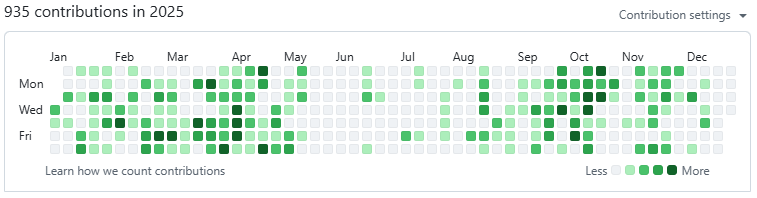
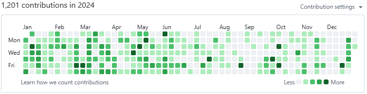
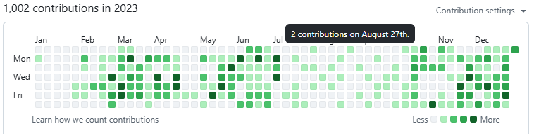
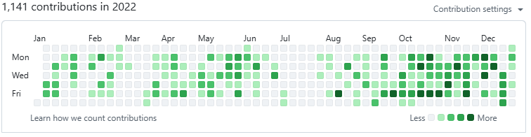
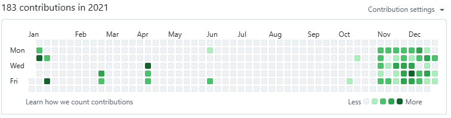
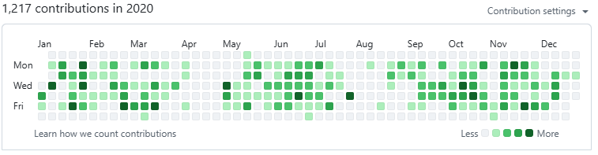
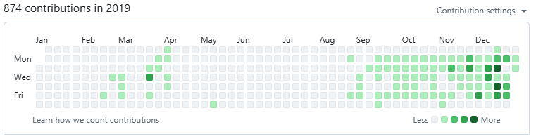
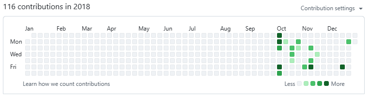

To calculate: Each box is 10x10 pixel with 3 pixel whitespace between them. This results in a height of 7x10 + 6*3 = 88 pixel per year and a width of (52+1+1)*10 + 53*3 = 699 pixel.

## Better looking if closer together?

I combined above screenshots into one picture where the results are closer together. An inspiration?

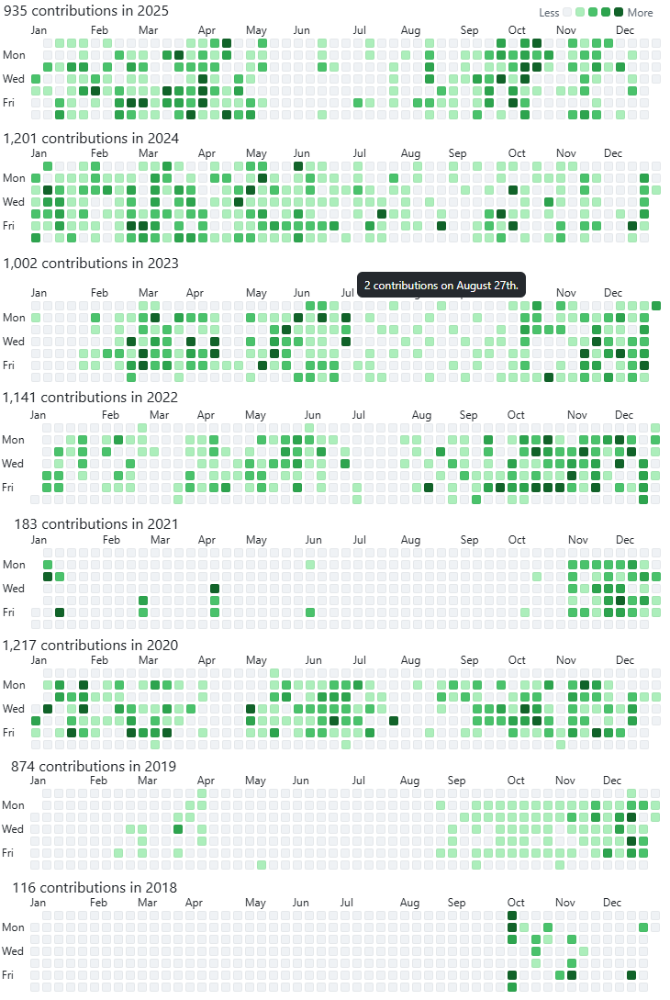

## 19000 days till 10/10/2027

On this day I will have lived 19000 days on earth, and the graduation from SDW will be 17 years ago. How would an overview of all these days look like? Here is a preliminary visual:

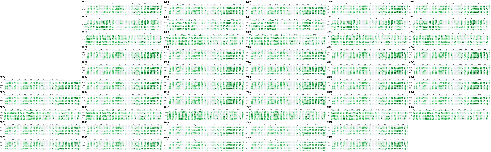

## Or  maybe Statistics for 21639 days

## Workflow

Ultimately we only want the summary numbers for 4 metrics: pages, words, time-to-read and images. This is collected from 5 places:

1) **Diary** - Obsidian vault, rendered for the web with Quartz, containing 🟩 Diary, 🟨 Travel, 🟦 Projects and another 🟥 Blog
2) **Blog** or Wordpress - using PHP and MariaDB on [saiht.de/blog](https://saiht.de/blog/) 🟥 Wordpress Blog
3) **Legacy** - historic pages from saiht.de on [saiht.de/legacy](https://saiht.de/legacy/) 🟦 Projects
4) **Subdomains** of saiht.de - the 10 smaller projects, see [saiht.de/x](https://saiht.de/x/) 🟦
5) **GitHub** - all of them have a Github Page, the metrics are taken from the webpage 🟦

### Static data - sources 2 to 5

Only from time to time I will update the following values:

- /data/details_wordpress.csv with all articles written 🟥
- /data/details_legacy.csv with all the articles written 🟦
- /data/details_subdomain.csv with all the articles written 🟦
- /data/details_github.csv with all the repositories and their main README.md of content 🟦Github: xx_name_xx created

The update program is `/python/update_details.py`. It parses above 4 files and updates the `/data/summary.csv`. Each static data file can be updated with a respective `/data/update_xx.py` for the 4 sources.

For the clickable graphics I need a date, title and link. Condensed to `/data/data_graph_wordpress.csv` and the 3 other files.

### Automatic run

Each push and successful run from quartz will trigger `python/update_statistics.py`. The Github Action will check out all data. All static data from above will have been processed already. No need to parse them again.

But I need a copy of Obsidian and parse it:

- **Blog**, read the frontmatter entry for the date in `date`. It's a second source for 🟥 Blog
- **Diary**, parse 1975.md to 2026.md for DD.MM.YYYY and count the day if it is bold, for 🟩 Diary
- **Projects**, maybe one day a copy of each README for each Github project? But that's two locations to keep updated 🟦 Projects
- **Travel**, the frontmatter has two entries `created` for when the holiday started and `updated` when it ended. Can it be parsed? Full color for start, dimmed between: 🟨 Travel
- **Websites** should be treated as projects, and be counted there too. so 🟦 Projects

For the clickable `STAT_GRAPHS` I need to know each day and number of contributions for the 4 categories. And the tooltip could include a link to the article of the day in Blog, Diary, Travel or Project.

### Parts to update in README.md

With some HTML markers and regular expressions parts of the README.md are prepared to be updated by the update python program. The following labels are in there:

- STAT_SUMMARY
- STAT_CATEGORY_LOCATIONS
- STAT_GRAPHS (last 10 years?)
- STAT_DETAILS_OBSIDIAN
- STAT_GITHUB (include categories)

### Updated files in this repository

Obviously the results should be written back to the repository. We need the file names for the Github Action `github/workflows/update.yml` that should receive a push `git add data/iteration.json data/version.txt`:

- data/iteration.json
- data/version.txt
- README.md
