# Examples and inspiration

Some progress was made with Obsidian, and in time I will copy a lot of information to this markdown diary and repository. While doing so I might add some translation of existing German documentations there.

Planned outlook:

## 2025

- Diary: 20
- Projects: 5
- Blog: 3
- Travel: 2

## 2024

- Highlights with links?
- Only one?
- Calculated score?

## Layered

Last processed: 2025/12/18 - 18,339 days

- Diary: 513
- Projects: 16
- Blog: 38
- Travel: 32

## By month in Diary/Travel/Projects/Blog

Maximum value:

- Diary: 31 - January 1997 🟩 
- Projects: 15 - March 2006 🟦
- Travel: 28 - August 2024 🟥
- Blog: 5 - October 2009 🟨

Table created by Python (GitHub has 4 shades plus white, but this can be tweaked once we have answers):

|      |   xxx0   |    xxx1   |    xxx2    |    xxx3   |   xxx4   |    xxx5   |    xxx6   |   xxx7   |    xxx8   |   xxx9   |   xxx10   |
|------|:--------:|:---------:|:----------:|:---------:|:--------:|:---------:|:---------:|:--------:|:---------:|:--------:|:---------:|
| 202x |  8/6/0/1 |  12/1/4/4 |  10/7/4/9  |  13/8/5/5 |  6/8/4/7 |  8/1/5/6  |           |          |           |          |           |
| 201x | 3/0/1/13 | 20/2/3/12 |  10/7/5/5  |  2/7/3/12 |  2/2/1/3 |  7/7/0/8  |  0/11/0/5 | 0/10/5/3 | 19/10/0/9 | 10/2/4/9 | 20/10/2/6 |
| 200x |  1/5/4/6 |  10/5/4/2 |  8/7/4/10  |  13/2/3/6 | 4/10/1/7 |  9/2/3/0  |  17/0/3/4 |  7/8/0/9 |  7/7/4/2  | 8/10/3/4 |  3/1/2/13 |
| 199x |  0/9/1/6 |  18/4/4/4 |  10/12/2/2 |  2/4/2/5  | 4/10/4/9 |  4/5/1/6  |  14/6/5/0 |  8/0/3/9 |  6/12/2/3 |  1/6/5/3 | 13/10/4/3 |
| 198x | 1/6/0/10 |  0/7/1/11 | 10/11/1/13 | 11/7/4/11 |  4/6/3/5 | 13/2/5/11 | 1/11/1/13 |  5/8/3/7 | 11/6/4/10 |  5/9/0/0 |  6/11/1/2 |
| 197x |          |           |            |           |          |  0/9/1/6  |  3/2/0/1  | 9/3/2/13 | 7/10/2/10 | 17/1/5/6 |  4/8/5/9  |

Data stored in `.csv`-files. How to parse, how to generate?

## One box per day - 18,000 boxes?

How would it look if you get a colored box for each day of your life? Well, let's have a look, just use GitHub contributions as example for the last 8 years:

## Better looking if closer together?

I combined above screenshots into one picture where the results are closer together. An inspiration?

## 6 columns - 19000 days until 2027/10/10

## 4 columns - 13 rows 1975-2026

That's actually for 15 rows for all 21639 days until 2034/12/31. Progression is top → bottom and left → right. For my life until 2026 that would currently look like this:

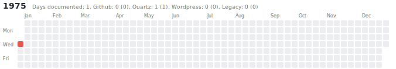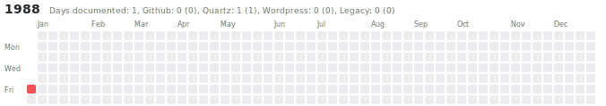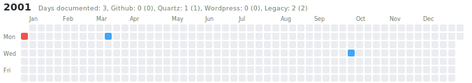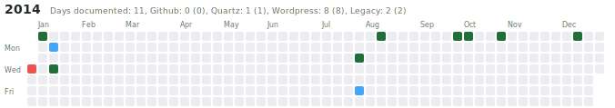
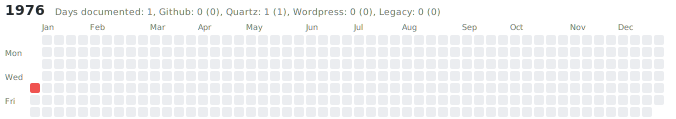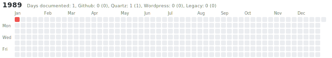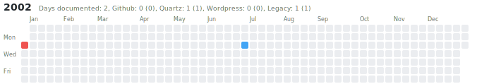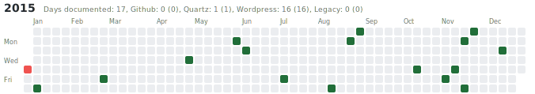
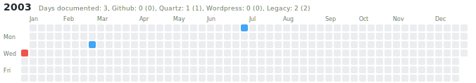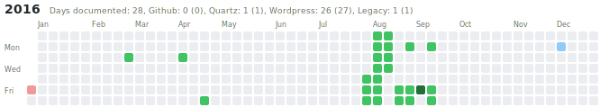
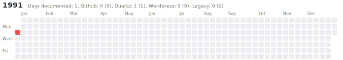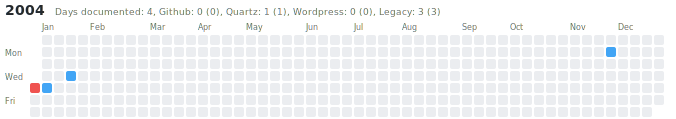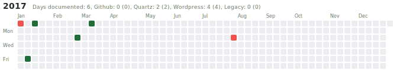
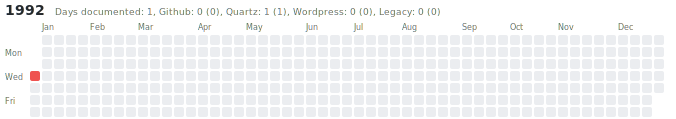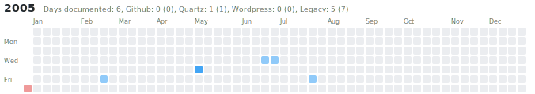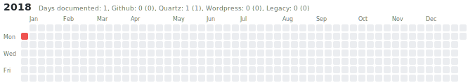
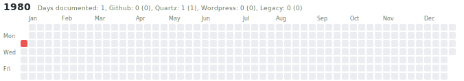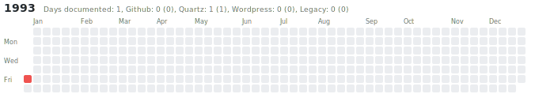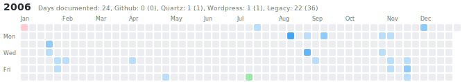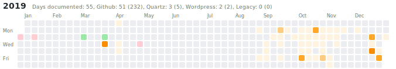
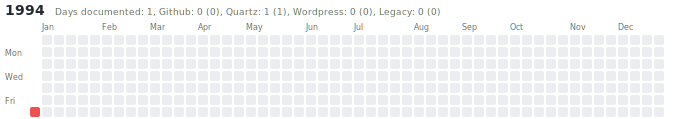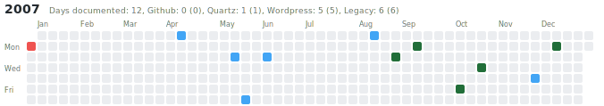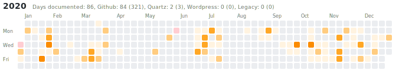
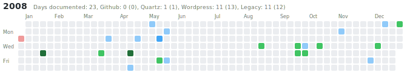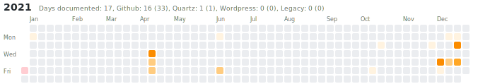
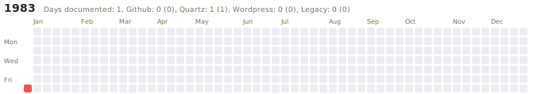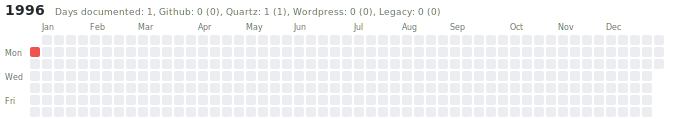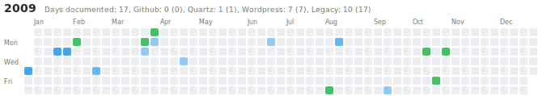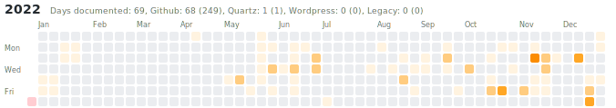
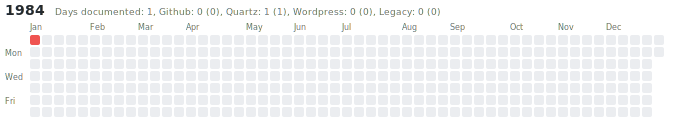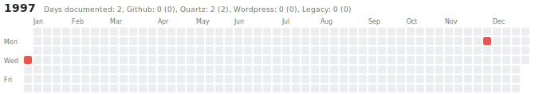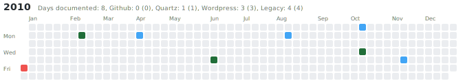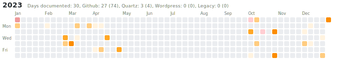
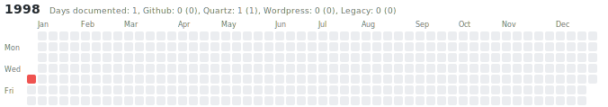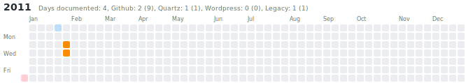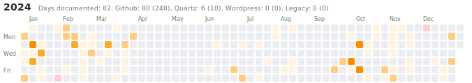
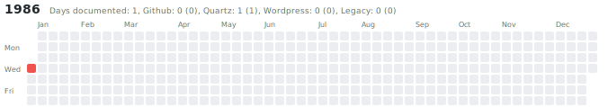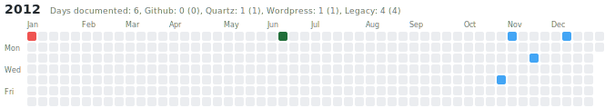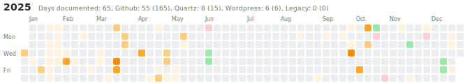
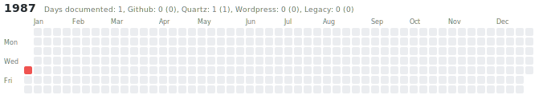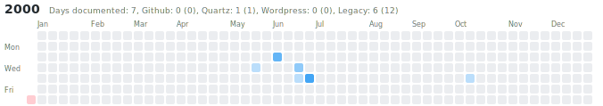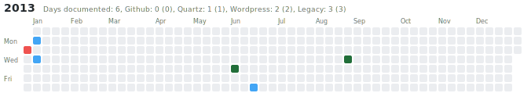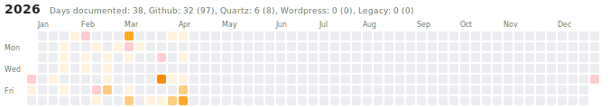

## 3 columns - 18 rows 1975-2028

It is only 51 years from 1975 to 2026, but since you need one image for each year including 1975 and 2026 you would actually need 52 boxes, and this can't be divided by 3. Let's add two more years for the 18th row we just started, and visualize now top to bottom:

